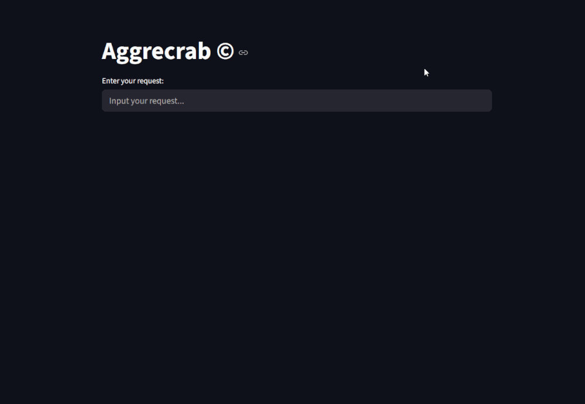

# Aggrecrab 🦀
A news aggregation tool (*who reads newspapers in 2025 though?*)

## 📝 Overview
  
**Aggrecrab** fetches RSS feeds and ranks articles based on your request by using cutting-edge AI/ML technologies (*for 1995*) 

## 🔧 Tech stack
- Frontend: **streamlit**
- Backend: None (lmao, works locally rn; **feedparser** for parsing)
- RecSys: **nltk**, **scikit-learn**

## 🤖 Recommendation system
### Current implementation:
1. Fetches RSS-feeds from custom `config.yaml` [example](#example-config)  
🚩Always check `robots.txt` and Terms of Service
2. Asks the user for a request (so-called *"anchor text"*)
3. Creates a **TF-IDF** matrix for both *anchor text* and *fetched articles*
4. Finds similarities using scikit\`s `linear_kernel()`
5. Ranks the articles
6. **Shows results!**

## 🔮 Future plans
- Automatic finding of appropriate RSS-feeds (with `robots.txt` check!)
- Cool UI/UX

## ✏️ Example `config.yaml`
```yaml
sources:
  - https://feeds.feedburner.com/PythonSoftwareFoundationNews
  - https://realpython.com/atom.xml?format=xml
  - https://pyimagesearch.com/feed
  - https://planetpython.org/rss20.xml
  - https://pbpython.com/feeds/all.atom.xml
  - https://blog.jetbrains.com/pycharm/feed
  - https://devblogs.microsoft.com/python/feed
top_n: 5  # How many articles to show?
language: english # Actually shouldn't work on anything else
```

## 💻 Installation guide (Untested though, pray it works🙏)
```powershell
git clone https://https://github.com/unisom0rphic/aggrecrab
cd aggrecrab
python -m venv .  # Python 3.11 recommended
cd src
pip install -r requirements.txt  # Hopefully no conflicts...
streamlit run main.py  # Keep in mind you need config.yaml in /src/ folder, you can copy example
```

## 🎉 Contributing
**PRs welcome!**

## 📜 License
*Aggrecrab* is distributed under the MIT License, meaning you are technically free to steal the project